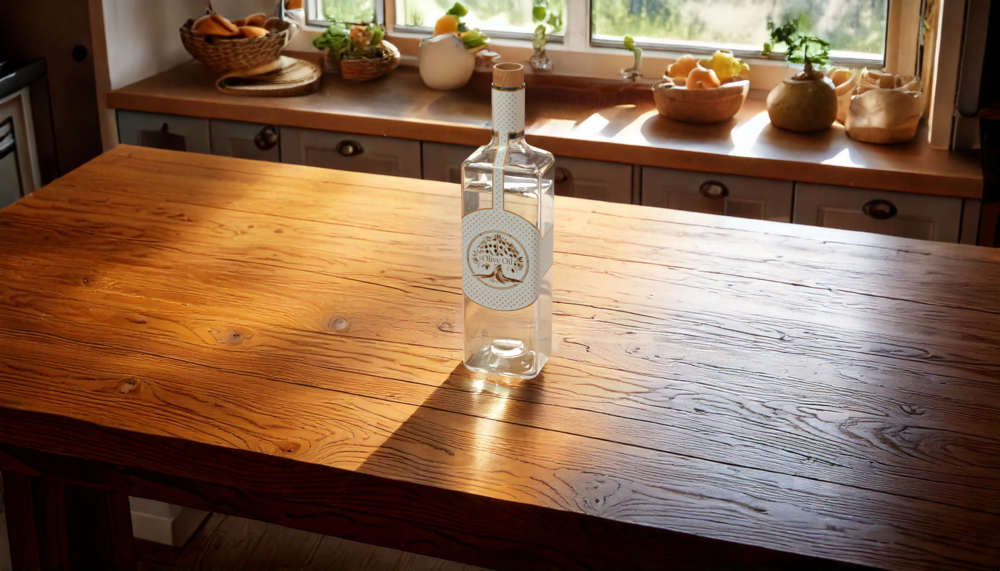

# 2D/3D Compositing API Tutorial

Combine 3D models with AI-generated content using the [2D/3D Compositing API][1].

## Overview

Learn how to create compelling images by combining 3D models with AI-generated content using the [2D/3D Compositing API][1]. This guide walks you through the process of uploading assets, configuring compositing parameters, and generating final images.



## Prerequisites

- You'll need a Substance 3D API **Client ID** and **Access Token**. learn how to retrieve them in the [Authentication Guide][2].
- A command line tool to transfer data, such as [cURL][3].

## Step 1 - Upload source assets

1. Download the sample assets:

   - [3D Scene (compositing_table_bottle.glb)][4]

2. To upload the 3D scene file to a new [digital storage **Space**][6], use the `/spaces` endpoint and define the asset as a `--form` parameter in the request.
   Run the following command to create the new Space:

```sh
curl --url https://s3d.adobe.io/v1beta/spaces \
--header 'Authorization: Bearer $S3D_FF_SERVICES_ACCESS_TOKEN' \
--form '.="@compositing_table_bottle.glb"'
```

The result is a JSON response that contains the `id` of the new Space.
This ID is the assets' *source* in the job definition.

**Sample Response**

```json
{
  "id": "{GENERATED_SPACE_ID}",
  "files": [...],
  ...
}
```

## Step 2 - Define assets sources

Create a *payload.json* file and reference the Space ID (`<generated_space_id>`) in the `sources` array:

<CodeBlock slots="heading, code" languages="JSON" />

*payload.json*

```json
{
  "sources": [
    {
      "space": {
        "id": "<generated_space_id>"
      }
    }
  ]
}
```

## Step 3 - Set the compositing parameters

To perform a compositing job, define:

- The **hero asset name** (the asset that should be rendered) from your scene file. `bottle` in this example.
- The **camera name** from your scene file. `main_camera` in this example.
- A **prompt** that describes the content of the AI-generated environment that will be composited with your 3D asset.

<InlineAlert variant="info" slots="text" />

If your 3D scene contains multiple models, only the one marked as the **hero asset** is rendered.
Additional models are used as *structural reference templates* to influence the composition of the AI-generated environment.

In this example, the 3D scene contains two models:

- a `bottle` model (*hero asset*) to be rendered.
- a `table` model, used to match the 3D scene layout in the generated background image.

With this information, append the following parameters to your `payload.json` file:

<CodeBlock slots="heading, code" languages="JSON" />

*payload.json*

```json
{
  "sources": [
    {
      "space": {
        "id": "<generated_space_id>"
      }
    }
  ],
  "heroAsset": "bottle",
  "cameraName": "main_camera",
  "prompt": "french style kitchen with empty wooden table window on the left focal length 50mm"
}
```

## Step 4 - Execute the API request

It's time to execute the compositing API request, using the job definition from your `payload.json` file.

Send a request to the [Compose API](../../api/index.md):

```sh
curl -vX POST https://s3d.adobe.io/v1beta/3dscenes/compose \
-d @payload.json \
--header "Content-Type: application/json" \
--header 'Authorization: Bearer $S3D_FF_SERVICES_ACCESS_TOKEN'
```

The response will be similar to this:

```json
{
  "$schema": "https://s3d.adobe.io/schemas/ComposeSceneResponse.json",
  "url": "https://s3d.adobe.io/v1beta/jobs/1727790895129-0", // The URL to poll the job's status and result
  "id": "1727790895129-0", // A unique identifier for the job
  "status": "running"
}
```

## Step 5 - Download the rendered images

After sending the API request, you'll obtain a response containing an URL that can be used to fetch the job's progress and result.

Since [jobs are asynchronous][7], their result isn't available immediately.
The job URL must be polled until the status indicates either `succeeded` or `failed`.

```sh
curl --url {JOB_URL} \
--header 'Accept: application/json' \
--header 'Authorization: Bearer $S3D_FF_SERVICES_ACCESS_TOKEN'
```

If the job succeeds, the response will contain an additional `result` property with information about the generated resources.

<CodeBlock slots="heading, code" repeat="2" languages="JSON, JSON" />

Response (succeeded)

```json
{
  "$schema": "https://s3d.adobe.io/schemas/ComposeSceneResponse.json",
  "url": "https://s3d.adobe.io/v1beta/jobs/1727790895129-0",
  "id": "1727790895129-0",
  "status": "succeeded",
  "result": {
    "outputs:": [
      {
        "image": {
          "seed": 63000,
          "url": "https://s3d.adobe.io/v1beta/spaces/s-b93fa62b-6ba8-4ca6-842d-898057bf5dbc/files/render0000.png?x-s3d-presigned-token=<auto_generated_token>"
        },
        ...
      }
    ],
    "promptHasDeniedWords": false,
    "promptHasBlockedArtists": false,
    "outputSpace": {
      "url": "https://s3d.adobe.io/v1beta/spaces/s-b93fa62b-6ba8-4ca6-842d-898057bf5dbc",
      "id": "s-b93fa62b-6ba8-4ca6-842d-898057bf5dbc",
      "archiveUrl": "https://s3d.adobe.io/v1beta/presigned-spaces/s-b93fa62b-6ba8-4ca6-842d-898057bf5dbc/zip?x-s3d-presigned-token=<auto_generated_token>",
      "files": [
        {
          "name": "render0000.png",
          "size": 3894406,
          "url": "https://s3d.adobe.io/v1beta/spaces/s-b93fa62b-6ba8-4ca6-842d-898057bf5dbc/files/render0000.png?x-s3d-presigned-token=<auto_generated_token>"
        },
        ...
      ]
    }
  }
}
```

Response (failed)

```json
{
  "$schema": "https://s3d.adobe.io/schemas/ComposeSceneResponse.json",
  "url": "https://s3d.adobe.io/v1beta/jobs/1727790895129-0",
  "id": "1727790895129-0",
  "status": "failed",
  "error": "error message"
}
```

To download the rendered images, you can use the pre-signed URLs included in the response (`result.outputs[].image.url`), or find the rendered images URL from the list of files in the response (`result.outputSpace.files[].url`).

```sh
curl -O --url https://s3d.adobe.io/v1beta/spaces/s-b93fa62b-6ba8-4ca6-842d-898057bf5dbc/files/render0000.png?x-s3d-presigned-token=<auto_generated_token>
```

## Deepen your understanding

Now that you completed this tutorial, visit its [API Reference][5] to explore more advanced use cases of 2D/3D compositing.

<!-- Links -->
[1]: /guides/api/compose_scene/
[2]: /getting_started
[3]: https://curl.se/download.html
[4]: https://cdn.substance3d.com/v2/files/public/compositing_table_bottle.glb
[5]: /api
[6]: ../../getting_started/assets_upload/index.md#using-spaces
[7]: ../../getting_started/asynchronous_jobs/
