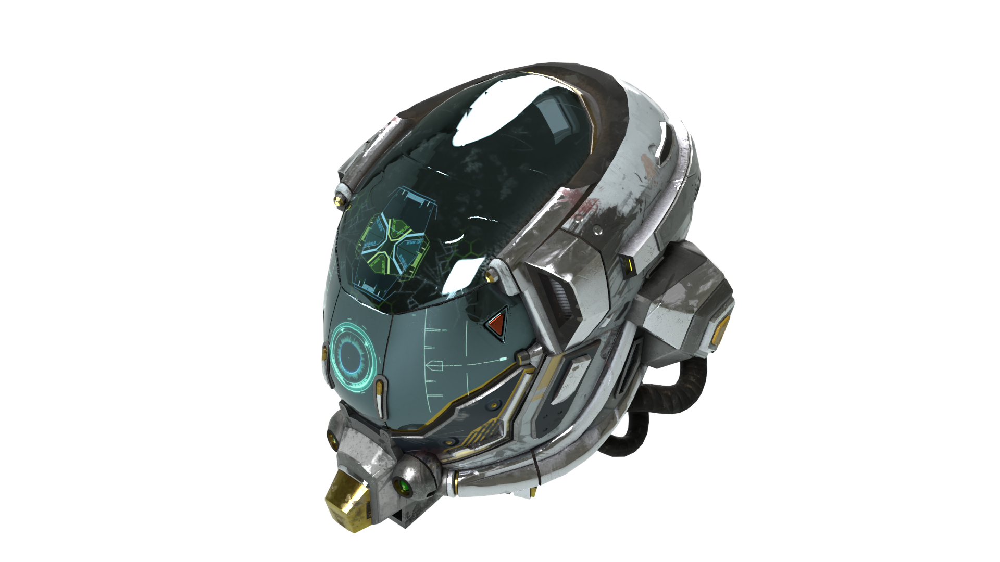
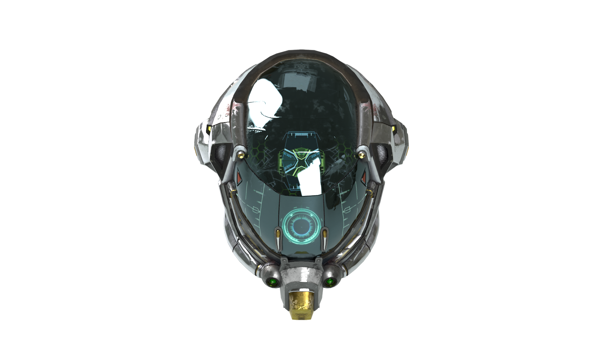
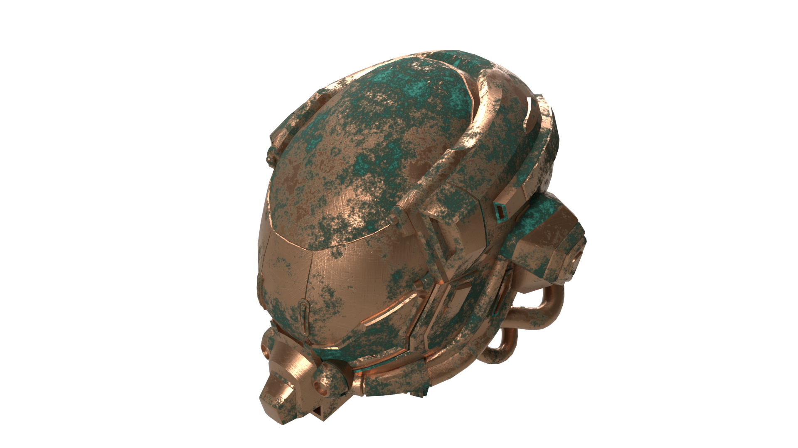

# Render 3D Object

## Overview

This guide shows you how to use the Substance 3D API to render 3D objects. You'll learn how to upload assets, configure rendering parameters, and customize the output with different camera angles and materials.



## Prerequisites

- If you don't already have a Substance 3D API **Client ID** and **Access Token**, learn how to retrieve them in the [Authentication Guide][1] before reading further. **Securely store these credentials and never expose them in client-side or public code.**
- A command line tool to transfer data, such as [cURL][2].

## Step 1 - Upload source assets

1. Download the sample assets prepared for this guide:

  - [3D Model (DamagedHelmet.glb)][3]
  - [Substance Material (cross_brushed_copper.sbsar)][4]

2. To use these assets, create a new [digital storage **Space**][6] with the `/spaces` endpoint and define each asset as a `--form` parameter in the request.

  Run this command to create the new Space:

```sh
curl --url https://s3d.adobe.io/v1/spaces \
--header 'Authorization: Bearer $S3D_FF_SERVICES_ACCESS_TOKEN' \
--form '.="@DamagedHelmet.glb"' \
--form '.="@cross_brushed_copper.sbsar"'
```

The JSON response contains an `"id"`, which identifies the new Space.
This ID will be the assets' *source* in the job definition.

**Example response**

```json
{
  "id": "{GENERATED_SPACE_ID}",
  "files": [...],
  ...
}
```

## Step 2 - Define assets sources

Create a *payload.json* file and define the Space with its ID (your `{GENERATED_SPACE_ID}`) in the `sources` array.

<CodeBlock slots="heading, code" languages="JSON" />

*payload.json*

```json
{
  "sources": [
    {
      "space": {
        "id": "{GENERATED_SPACE_ID}"
      }
    }
  ]
}
```

## Step 3 - Set the rendering parameters

To perform a rendering job, define the model file of the scene with the file located in the Space.
To use the `DamagedHelmet.glb` file, set its path in the `scene.modelFile` property.

<CodeBlock slots="heading, code" languages="JSON" />

*payload.json*

```json
{
  "sources": [
    {
      "space": {
        "id": "{GENERATED_SPACE_ID}"
      }
    }
  ],
  "scene": {
    "modelFile": "DamagedHelmet.glb"
  }
}
```

## Step 4 - Execute the API request

It's time to execute the rendering API request, using the job definition from your `payload.json` file.

Send a request to the [**v1/scenes/render-basic**][5] endpoint:

```sh
curl -X POST https://s3d.adobe.io/v1/scenes/render-basic \
-d @payload.json \
--header "Content-Type: application/json" \
--header 'Authorization: Bearer $S3D_FF_SERVICES_ACCESS_TOKEN'
```

The response will be similar to this example, with a unique `id`:

```json
{
  "$schema": "https://s3d.adobe.io/schemas/RenderModelResponse.json",
  "url": "https://s3d.adobe.io/v1/jobs/1727790895129-0",
  "id": "1727790895129-0", // unique job ID
  "status": "running"
}
```

## Step 5 - Download the rendered image

After sending the API request, you'll receive a response with a `url` property.
Since [jobs are asynchronous][7], their result isn't available immediately.

1. The job URL must be polled to see the status.

```sh
curl --url https://s3d.adobe.io/v1/jobs/1727790895129-0 \
--header 'Accept: application/json' \
--header 'Authorization: Bearer $S3D_FF_SERVICES_ACCESS_TOKEN'
```

If the job succeeds, the response will contain a `result` property with information about the generated resources:

<CodeBlock slots="heading, code" repeat="2" languages="JSON, JSON" />

Response (*succeeded*)

```json
{
  "$schema": "https://s3d.adobe.io/schemas/RenderModelResponse.json",
  "url": "https://s3d.adobe.io/v1/jobs/1727790895129-0",
  "id": "1727790895129-0",
  "status": "succeeded",
  "result": {
    "renderUrl": "https://s3d.adobe.io/v1/spaces/s-b93fa62b-6ba8-4ca6-842d-898057bf5dbc/files/render0000.png?x-s3d-presigned-token=<auto_generated_token>", // pre-signed URL, used to download the rendered image
    "outputSpace": {  // output Space, containing the list of generated resource files
      "url": "https://s3d.adobe.io/v1/spaces/s-b93fa62b-6ba8-4ca6-842d-898057bf5dbc",
      "id": "s-b93fa62b-6ba8-4ca6-842d-898057bf5dbc",
      "archiveUrl": "https://s3d.adobe.io/v1/presigned-spaces/s-b93fa62b-6ba8-4ca6-842d-898057bf5dbc/zip?x-s3d-presigned-token=<auto_generated_token>",
      "files": [
        {
          "name": "render0000.png",
          "size": 235441,
          "url": "https://s3d.adobe.io/v1/spaces/s-b93fa62b-6ba8-4ca6-842d-898057bf5dbc/files/render0000.png?x-s3d-presigned-token=<auto_generated_token>"
        },
        ...
      ]
    }
  }
}
```

Response (*failed*)

```json
{
  "$schema": "https://s3d.adobe.io/schemas/RenderModelResponse.json",
  "url": "https://s3d.adobe.io/v1/jobs/1727790895129-0",
  "id": "1727790895129-0",
  "status": "failed",
  "error": "error message"
}
```

2. To download the rendered image, use the pre-signed URL included in the response (`result.renderUrl`), or find the rendered image URL from the list of files in the response (`result.outputSpace.files[].url`).

```sh
curl -O --url https://s3d.adobe.io/v1/spaces/s-b93fa62b-6ba8-4ca6-842d-898057bf5dbc/files/render0000.png?x-s3d-presigned-token=<auto_generated_token>
```


## Step 6 - Going further with optional settings

It's possible to render images by specifying only the source 3D model location, but this API also exposes optional settings to customize different aspects of the rendered image such as the model transforms, the camera parameters, overriding the default material, and more.

Let's make few changes to these optional settings below to explore the results. See the full list of settings available in the [API Reference][5].

### Render different camera angles

Modify the camera angle by setting the `scene.camera` field in the payload.

1. To set the camera azimuth angle to 0, replace the `payload.json` content with the following lines:

<CodeBlock slots="heading, code" languages="JSON" />

*payload.json* - 'Azimuth 0'

```json
{
  "sources": [
    {
      "space": {
        "id": "{GENERATED_SPACE_ID}"
      }
    }
  ],
  "scene": {
    "modelFile": "DamagedHelmet.glb",
    "autoFraming": {
      "zoomFactor": 0.7 // zoom out
    },
    "camera": {
      "focal": 50,
      "transform": {
        "azimuthAltitude": {
          "azimuth": 0, // custom camera azimuth

          // the following values are identical to the default ones
          "altitude": 30,
          "lookAt": [0, 0, 0],
          "radius": 1
        }
      }
    }
  }
}
```

2. Re-execute the API request and download the rendered image.

**Sample result**



### Override materials

Render variations of the same object in different materials by using `scene.materialOverrides`.

Let's override the existing model's material with one from the sample assets: `cross_brushed_copper.sbsar`.

1. Replace the `payload.json` content with the following lines:

<CodeBlock slots="heading, code" languages="JSON" />

*payload.json* - 'Material override'

```json
{
  "sources": [
    {
      "space": {
        "id": "{GENERATED_SPACE_ID}"
      }
    }
  ],
  "scene": {
    "modelFile": "DamagedHelmet.glb",
    "materialOverrides": [
      {
        "materialName": "Material_MR", // the name of the existing material assigned to the 3D model
        "pbrMaterial": {
          "resolution": 2048, // increased texture resolution
          "sbsar": "cross_brushed_copper.sbsar"
        }
      }
    ]
  }
}
```

2. Re-execute the API request and download the rendered image.

**Cross Brushed Copper**


#### Going further with substance materials

The `cross_brushed_copper.sbsar` file is a *Substance 3D Material* which includes pre-built variations (a.k.a. *preset*):

- `Default` (selected by default if none is specified)
- `Rust Picked Copper Cross Brushed`
- `Shiny Copper Cross Brushed`
- `Oxidized Copper Cross Brushed`

By slightly modifying the previous job definition, you can apply these presets on the material:

<CodeBlock slots="heading, code" languages="JSON" />

*payload.json* - 'Material preset'

```json
{
  "sources": [...],
  "scene": {
    "modelFile": "DamagedHelmet.glb",
    "materialOverrides": [
      {
        "materialName": "Material_MR",
        "pbrMaterial": {
          "preset": "Rust Picked Copper Cross Brushed", // select the material preset
          "resolution": 2048,
          "sbsar": "cross_brushed_copper.sbsar"
        }
      }
    ]
  }
}
```

**Oxidized Copper Cross Brushed**



## Deepen your understanding

Now that you completed this tutorial, visit its [API Reference][5] to explore more advanced use cases of 3D object rendering.

<!-- Links -->
[1]: /getting_started
[2]: https://curl.se/download.html
[3]: https://raw.githubusercontent.com/KhronosGroup/glTF-Sample-Assets/main/Models/DamagedHelmet/glTF-Binary/DamagedHelmet.glb
[4]: https://cdn.substance3d.com/v2/files/public/4c26e92f-0801-437d-a900-8d3e67611549
[5]: /api/#tag/Scenes/operation/renderSceneBasic_v1
[6]: ../../getting_started/assets_upload/index.md#using-spaces
[7]: ../../getting_started/asynchronous_jobs/
