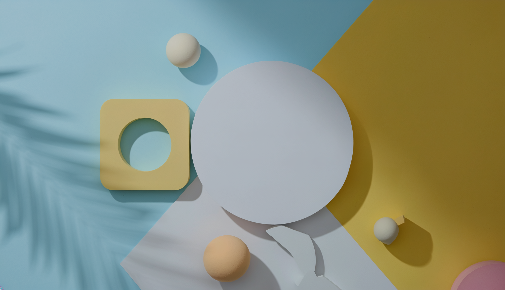

<Hero slots="image, heading, text" background="rgb(126, 183, 196)" theme="dark"/>

# Adobe Substance 3D API - Firefly Services

Unlock the potential of Cloud Rendering and Generative AI through an easy-to-use RESTful API.

## Overview

This documentation provides instructions for the Substance 3D API.

## Discover

<DiscoverBlock slots="heading, link, text"/>

### Get Started

[Quickstart Guide](/guides)

A quickstart guide to making your first successful Substance 3D API call.

<DiscoverBlock slots="link, text"/>

[Tutorials](/guides/render_3d_object)

Explore our tutorials page for comprehensive guidance.

<DiscoverBlock slots="heading, link, text"/>

### API Reference

[Try the API](/api)

Try the Substance 3D API. Explore, make calls, with full endpoint descriptions.

    
