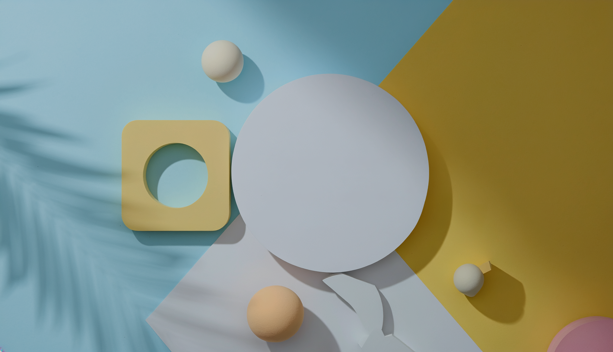

<Superhero slots="image, heading, text" background="rgb(126, 183, 196)" theme="dark"/>

# Adobe Substance 3D API - Firefly Services

Unlock cloud rendering and generative AI for 3D content through an easy-to-use RESTful API.

## Overview

The Adobe Substance 3D API brings professional 3D rendering and AI-powered compositing to your applications and workflows. Part of [Firefly Services](https://developer.adobe.com/firefly-services/docs/guides/?aio_internal), this REST API lets you render 3D models, assemble and convert scenes, and combine 3D objects with AI-generated backgrounds-all without local rendering hardware.

Upload assets from your server, a public URL, or Frame.io, submit jobs asynchronously, and retrieve high-quality images at scale. Whether you are building product configurators, marketing pipelines, or creative automation tools, the Substance 3D API integrates 3D and generative AI in a single platform.

## Discover

<DiscoverBlock slots="heading, link, text"/>

### Get Started

[Quickstart Guide](/guides/index.md)

Authenticate, upload assets, and make your first successful Substance 3D API call.

<DiscoverBlock slots="link, text"/>

[Authentication](/getting-started/index.md)

Set up OAuth Server-to-Server credentials and retrieve an access token.

<DiscoverBlock slots="heading, link, text"/>

### API Reference

[Try the API](/api/index.md)

Explore endpoints, request schemas, and response examples in the interactive API reference.

<DiscoverBlock slots="link, text"/>

[Tutorials](/guides/render-3-d-object/index.md)

Follow step-by-step guides for rendering and compositing 3D content.

## Generate 3D object composite

Combine 3D hero assets with AI-generated environments to create compelling marketing and product imagery.

### What is this API?

The [Generate 3D Object Composite API](/guides/generate-3-d-object-composite/index.md) allows you to:

* **Composite 3D objects with AI backgrounds** - Place a hero asset from your 3D scene into a Firefly-generated environment described by a text prompt.
* **Control camera and lighting** - Use cameras defined in your scene and optional lighting seeds for consistent, repeatable results.
* **Generate multiple variations** - Produce several background and lighting combinations in a single job to explore creative options.
* **Use structural reference models** - Include additional scene geometry to guide composition without rendering every model in the final image.

This API uses Adobe Firefly generative models alongside Substance 3D rendering technology to blend photorealistic 3D objects with AI-created backgrounds.

### Why choose Generate 3D Object Composite?

* **Scale product imagery** - Automate lifestyle and contextual shots for catalogs, e-commerce, and campaigns without a physical photo studio.
* **Prompt-driven environments** - Describe the scene you want in plain language and let Firefly generate matching backgrounds.
* **Consistent hero assets** - Keep your 3D product model fixed while varying the surrounding environment and lighting.
* **Reproducible outputs** - Use seeds to regenerate the same background or iterate with controlled variation.

## Render 3D object

Produce high-quality rendered images from 3D models with full control over camera, materials, and scene settings.

### What is this API?

The [Render 3D Object API](/guides/render-3-d-object/index.md) allows you to:

* **Render 3D models to images** - Convert GLB, glTF, and other supported 3D formats into PNG or other image outputs.
* **Customize camera angles** - Set focal length, azimuth, altitude, and framing to capture the view you need.
* **Override materials** - Apply Substance materials (`.sbsar`) to change surface appearance without editing the source model.
* **Start quickly with render-basic** - Use the simplified render endpoint when you need a fast path from model to image.

Cloud rendering runs on Adobe infrastructure, so you do not need dedicated GPU hardware in your environment.

### Why choose Render 3D Object?

* **Photorealistic output** - Leverage Substance 3D rendering for product visualization, asset previews, and marketing content.
* **Flexible customization** - Fine-tune transforms, auto-framing, and material overrides from a single API request.
* **Integrate with Firefly workflows** - Use rendered images as inputs to other Firefly Services APIs in automated creative pipelines.
* **Simple to advanced paths** - Begin with `render-basic` for quick results, then move to the full render endpoint for advanced scene control.

## Scene services

Prepare, convert, and inspect 3D scenes before rendering or compositing.

### What are scene services?

Scene endpoints help you work with 3D content across your pipeline:

* **Assemble 3D scenes** - Build scenes from multiple source assets for downstream rendering or compositing jobs.
* **Convert 3D files** - Transform 3D models between supported formats to normalize assets before processing.
* **Describe 3D scenes** - Retrieve metadata and structure from a scene file to understand cameras, assets, and layout programmatically.

### Why use scene services?

* **Normalize incoming assets** - Convert varied 3D formats to a consistent structure before rendering.
* **Inspect scenes automatically** - Discover camera names, hero assets, and scene hierarchy without manual inspection.
* **Prepare complex compositions** - Assemble multi-asset scenes that feed into render or composite workflows.

See the [API Reference](/api/index.md) for request and response details for each scene endpoint.

## Asset management

Upload and organize the 3D models, materials, and textures that power your jobs.

### What is a Space?

A **Space** is a temporary digital container for assets used by Substance 3D API operations. With Spaces, you can:

* **Upload local files** - Send 3D models, Substance materials, textures, and related assets in a single multipart request.
* **Reference assets in jobs** - Pass a Space ID in the `sources` array of any render, composite, or scene job.
* **Pull assets from URLs or Frame.io** - Use public URLs or Frame.io folders as alternative source types when local upload is not required.
* **Download job outputs** - Retrieve generated images and files from output Spaces using pre-signed URLs.

<InlineAlert variant="info" slots="text"/>

Spaces are temporary storage. They expire after 6 hours, and pre-signed download URLs expire after 30 minutes. Plan your workflow to fetch results promptly.

### Why use Spaces?

* **Flexible asset sourcing** - Choose the upload method that fits your pipeline: direct upload, URL, or Frame.io integration.
* **Reuse job outputs** - Chain jobs by using an output Space from one operation as the input source for the next.
* **Organize file trees** - Preserve folder structure when uploading textures and related assets alongside models.

Learn more in the [Create a Space for Assets guide](/guides/create-a-space/index.md) and the [Uploading Assets guide](/getting-started/assets-upload/index.md).

## How it works

Most Substance 3D API operations run as asynchronous jobs:

1. **Submit a job** - Send a POST request to a render, composite, or scene endpoint with your asset sources and parameters.
2. **Receive a job ID** - The API responds with `202 Accepted` and a URL to poll for status.
3. **Poll for completion** - Check the job status until it reaches `succeeded` or `failed`.
4. **Download results** - Retrieve rendered images and output files from pre-signed URLs in the job result.

You can also use blocking mode (`wait=true`) on supported endpoints when your client can tolerate longer request times. For details, see [Asynchronous Jobs](/getting-started/asynchronous-jobs/index.md).

## Ready to try it?

Start with the [Quickstart Guide](/guides/index.md) to authenticate and upload your first assets, then follow the [Render 3D Object](/guides/render-3-d-object/index.md) or [Generate 3D Object Composite](/guides/generate-3-d-object-composite/index.md) tutorial. For production integrations, review [Best Practices](/guides/best-practices/index.md) and the full [API Reference](/api/index.md).
